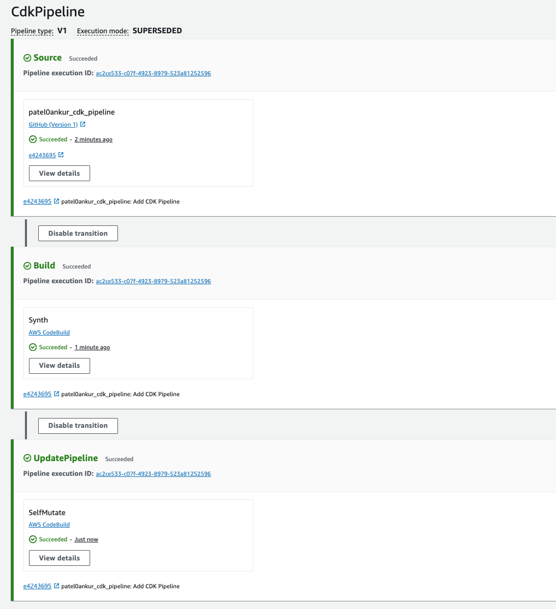

# Enhanced CI/CD with CDK Pipelines

1) Create a new directory under the main directory of your CDK project to store CDK pipeline code:

```
mkdir cdk_pipeline && cd cdk_pipeline
```

2) Initialize the CDK app. 

```
sudo cdk init app --language typescript
```

3) Update the *bin/cdk_pipeline.ts* file to add the *account* and *region* details for *CdkPipelineStack* stack. 

```
new CdkPipelineStack(app, 'CdkPipelineStack', {  
  env: {
    account: process.env.CDK_DEFAULT_ACCOUNT,
    region: process.env.CDK_DEFAULT_REGION
  }
});
```

4) Prepare a GitHub repository: 
   
   a) Create a Personal Access [Token](https://docs.github.com/en/authentication/keeping-your-account-and-data-secure/managing-your-personal-access-tokens#creating-a-personal-access-token-classic) for your repository with the scopes:
      
    - repo
    - admin:repo_hook

   b) Use AWS Secrets Manager to store the Personal Access Token. Adding the Token to the secret-string parameter

   ```
   aws secretsmanager create-secret --name cdk_pipeline_github --description 'OAuth token for CDK Pipeline Github Repo.' --secret-string '{"github":"YOUR_TOKEN_HERE"}'
   ```

   c) Update the *lib/cdk_pipeline-stack.ts* file to get Git repository details. 

   ```
   const git_hub_commit = pipelines.CodePipelineSource.gitHub(github_repo, "main",
      { authentication: cdk.SecretValue.secretsManager('cdk_pipeline_github', 
        { jsonField: 'github' }) 
      }
    )
   ```

   d) Commit the change to your repository.

   ```
   git add .
   git commit -m "Added GitHub username to pipeline file."
   git push
   ```

5) Deploy the CdkPipelineStack stack:
   
   ```
   cdk deploy
   ```
6) Add CodePipeline Construct:
   
   Open *lib/cdk_pipeline-stack.ts* file and add the code below to the bottom of the file, make sure you saved the file:

   ```
   const pipeline = new pipelines.CodePipeline(this, 'CdkPipeline', {

      pipelineName: 'CdkPipeline',
      crossAccountKeys: true,       // <---- For Cross Account Deployment
      codeBuildDefaults: {
        buildEnvironment: {
          privileged: true,
          buildImage: LinuxBuildImage.STANDARD_7_0
        }
      },
      synth: new pipelines.ShellStep('Synth',
        {
          input: git_hub_commit,
          commands: [
            'npm ci',
            'npm run build',
            'npx cdk synth'
          ]
        }
      )
    })
   ```

   Here we're using previously created GitHub repository as code source (input parameter). Notice the build_image parameter which points to the latest available CodeBuild image as build environment (STANDARD_7_0).

7) Push code changes to GitHub Repo:
   
   ```
   git commit -am "Add CDK Pipeline"
   git push
   ```

8) Deploy the CdkPipelineStack stack:
   
   ```
   cdk deploy
   ```
   After the deployment is complete, navigate to AWS CodePipeline service and click on the CdkPipeline pipeline. It will look similar to the screenshot below. Notice that it has UpdatePipeline stage which is responsible for updating the pipeline itself (self-mutate). At this point an AWS EventBridge Rule has also been created, and it'll trigger the pipeline on any commit to the main branch, so we won't need to run cdk deploy command manually again. Please note that the pipeline is already running so make sure that you've pushed your code to AWS CodeCommit before you create the pipeline.

   

9) Add deployment stages to the CDK pipeline:
   
   The pipeline has been created but apart from self-mutate feature, it doesn't do anything useful. Let's add deployment stages. We'll deploy both Development and Production stacks to the same account and region, whereas in real projects you most likely will deploy your stacks to multiple AWS account.

   a) Develop CDK code for a Lambda function that will be deployed using CodePipeline.
      
      ```
      mkdir lib/lambda_code/lambda-stack.ts
      ```

      Add following code in the above file:

      ```
      import { Stack, StackProps } from 'aws-cdk-lib';
      import { Construct } from 'constructs';
      import { Function, InlineCode, Runtime } from 'aws-cdk-lib/aws-lambda';
      import { CfnOutput } from 'aws-cdk-lib';
      
      export class MyLambdaStack extends Stack {
          constructor(scope: Construct, id: string, props?: StackProps) {
            super(scope, id, props);
      
            const lambda_function = new Function(this, 'LambdaFunction', {
              runtime: Runtime.PYTHON_3_12,
              handler: 'index.handler',
              code: new InlineCode("def handler(event, context):\n    print('Hello from       Lambda!')")
            })
      
            const function_name = new CfnOutput(this, 'LambdaArn', { value: lambda_function.functionName });
      
          }
      }
      ```
      In order to retrieve and use the function name down the pipeline, we need to export it which is done through CfnOutput.

    b) Create Development Deployment Stage.

    ```
    import * as cdk from 'aws-cdk-lib';
    import { Construct } from "constructs";
    import { MyLambdaStack } from './lambda_code/lambda-stack';
    
    
    export class DeploymentStage extends cdk.Stage {
    
        constructor(scope: Construct, id: string, props?: cdk.StageProps) {
            super(scope, id, props);
            
            const lambdaStack = new MyLambdaStack(this, 'LambdaStack');
        }
    }
    ```

    c) Add "DEV" environments deployment stages to the pipeline. Edit *lib/cdk_pipeline-stack.ts* file by replacing account IDs and regions to match your values:

    ```
    const dev_deployment_stage =  pipeline.addStage(new DeploymentStage(this, 'Dev',
      {env: {
        account: process.env.CDK_DEFAULT_ACCOUNT,
        region: process.env.CDK_DEFAULT_REGION
      }}
    ));
    ```
    
    Above we've defined Development environment deployment stage.

    d) Push code changes to GitHub:

    ```
    git add . && git commit -m "Add CDK Pipeline Stages" && git push
    ```

    After the push, the pipeline will be started and will update itself by adding new stages. Then it will restart with updated set of stages and run those newly added stages. Also, since our LambdaStack includes a Lambda function, there will be one extra Assets step which is responsible for uploading Lambda code to CDK's S3 Assets bucket.

    Navigate to the pipeline and wait until "DEV" deployment is complete.

    e) Repeat steps `b`, `c` & `d` for Prod deployment stage. 
    
    Production Deployment Stage.
    ```
    import * as cdk from 'aws-cdk-lib';
    import { Construct } from "constructs";
    import { MyLambdaStack } from './lambda_code/lambda-stack';
    
    
    export class ProdStage extends cdk.Stage {
    
        constructor(scope: Construct, id: string, props?: cdk.StageProps) {
            super(scope, id, props);
    
            const lambdaStack = new MyLambdaStack(this, 'LambdaStack');
        }
    }
    ```

    Add "Prod" environments deployment stages to the pipeline. Edit *lib/cdk_pipeline-stack.ts* file by replacing account IDs and regions to match your values:

    ```
    const prod_wave = pipeline.addWave("Prod");
    prod_wave.addStage(new ProdStage(this, 'Prod',
      {env: {
        account: process.env.CDK_DEFAULT_ACCOUNT,
        region: process.env.CDK_DEFAULT_REGION
      }}
    ));
    ```

    Push code changes to GitHub:

    ```
    git add . && git commit -m "Add CDK Pipeline Stages" && git push
    ```


     


